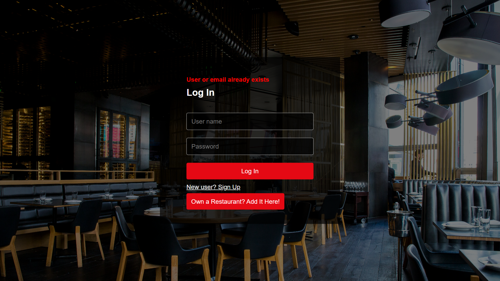
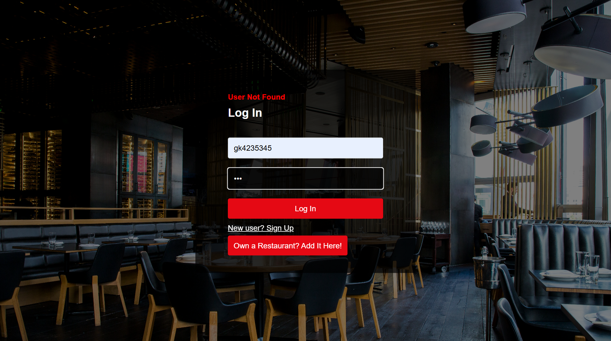
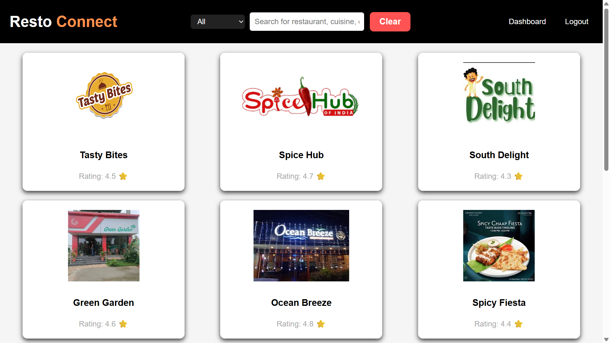
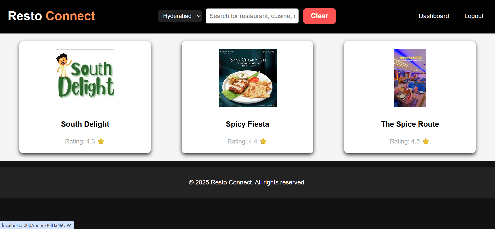
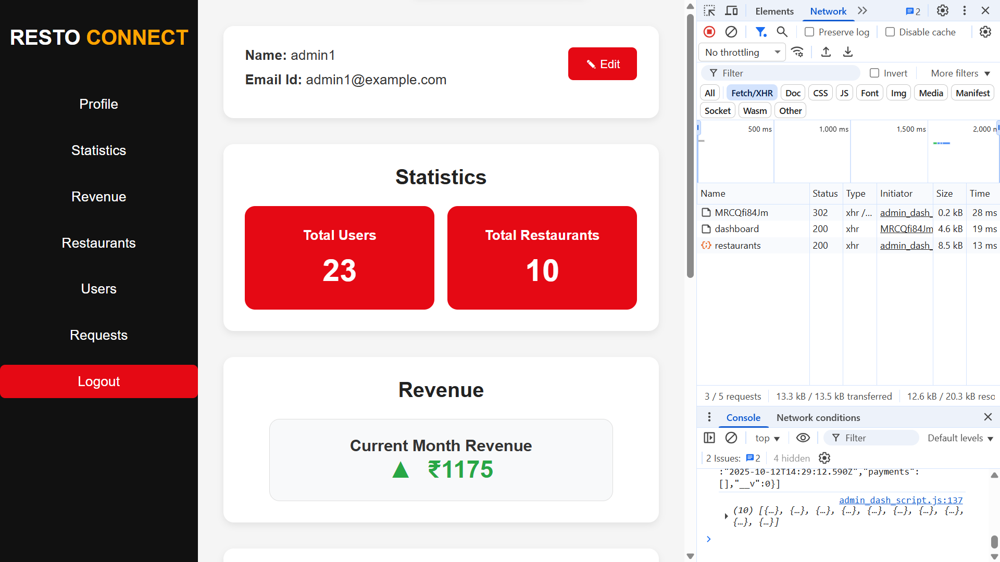
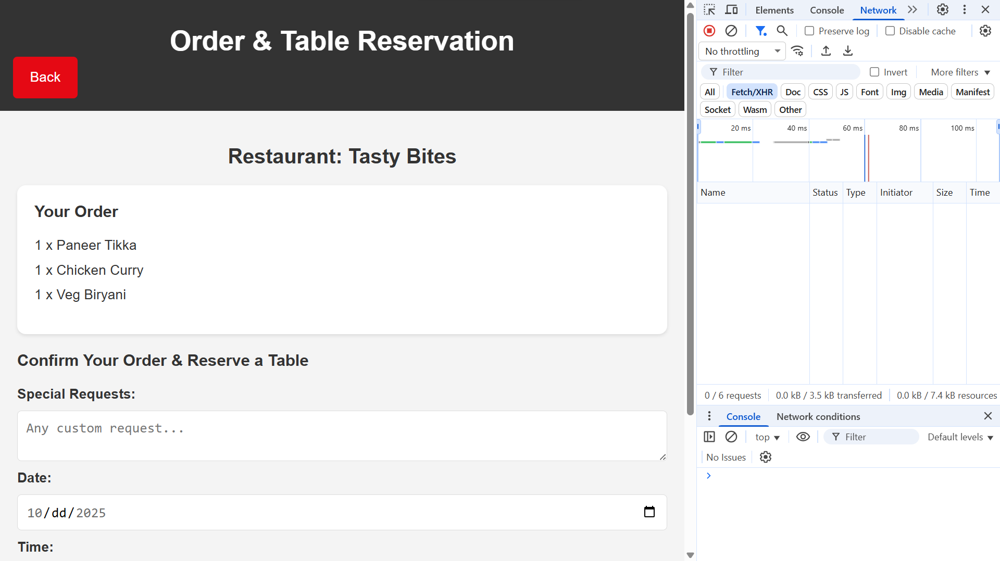
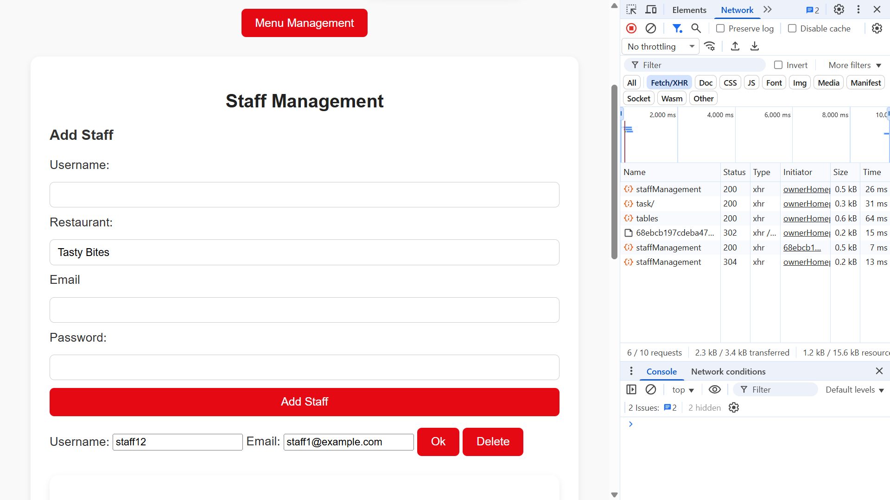
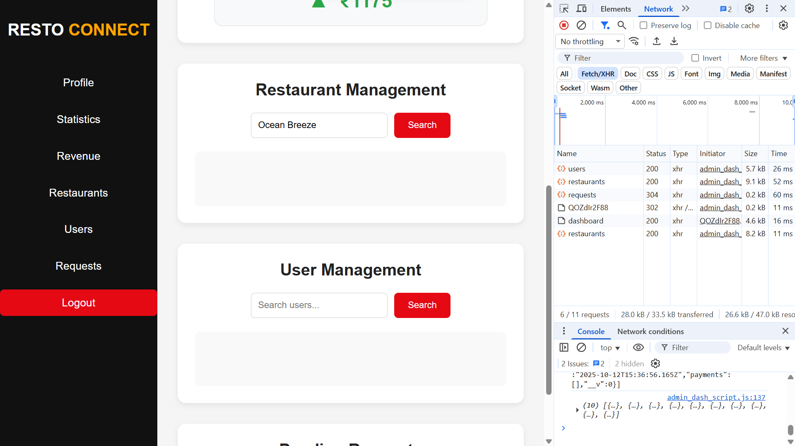

# RestoConnect Test Plan

## 1. Validation Test Cases

### Test Case: Signup with valid data
**Expected Result:** New user account created, redirected to dashboard.  
**Actual Result:** Account created successfully, dashboard loaded.  
**Status:** Pass  

---

### Test Case: Signup with existing email
**Expected Result:** Error message "Email already exists" displayed.  
**Actual Result:** Error message displayed correctly.  
**Status:** Pass  
**Evidence:**  

---

### Test Case: Login with invalid password
**Expected Result:** Error message "Invalid username/password" displayed.  
**Actual Result:** Error message displayed correctly.  
**Status:** Pass  
**Evidence:**  

---

### Test Case: Login with correct credentials
**Expected Result:** User logged in and redirected to appropriate dashboard.  
**Actual Result:** Login successful, redirected correctly.  
**Status:** Pass  
**Evidence:**  

---

## 2. Dynamic / DOM Updates Test Cases

### Test Case: Filter restaurants by location
**Expected Result:** Only restaurants in selected location displayed dynamically.  
**Actual Result:** Restaurants filtered correctly without page reload.  
**Status:** Pass  
**Evidence:**  

---

### Test Case: Admin dashboard statistics update
**Expected Result:** Total users, total restaurants updated in real-time without reload.  
**Actual Result:** Statistics updated correctly on page load.  
**Status:** Pass  
**Evidence:**  

---

## 3. Async / API Test Cases

### Test Case: Customer adds item to cart
**Expected Result:** Cart updated, quantity shows correct count.  
**Actual Result:** Cart updated immediately.  
**Status:** Pass  
**Evidence:**  

---

### Test Case: Owner updates staff details
**Expected Result:** Staff details updated in database, changes reflected on dashboard.  
**Actual Result:** Staff details updated successfully, dashboard refreshed automatically.  
**Status:** Pass  
**Evidence:**  

---

### Test Case: Admin deletes a restaurant
**Expected Result:** Restaurant removed from dashboard, backend confirms deletion.  
**Actual Result:** Restaurant deleted, dashboard updated instantly.  
**Status:** Pass  
**Evidence:**  

